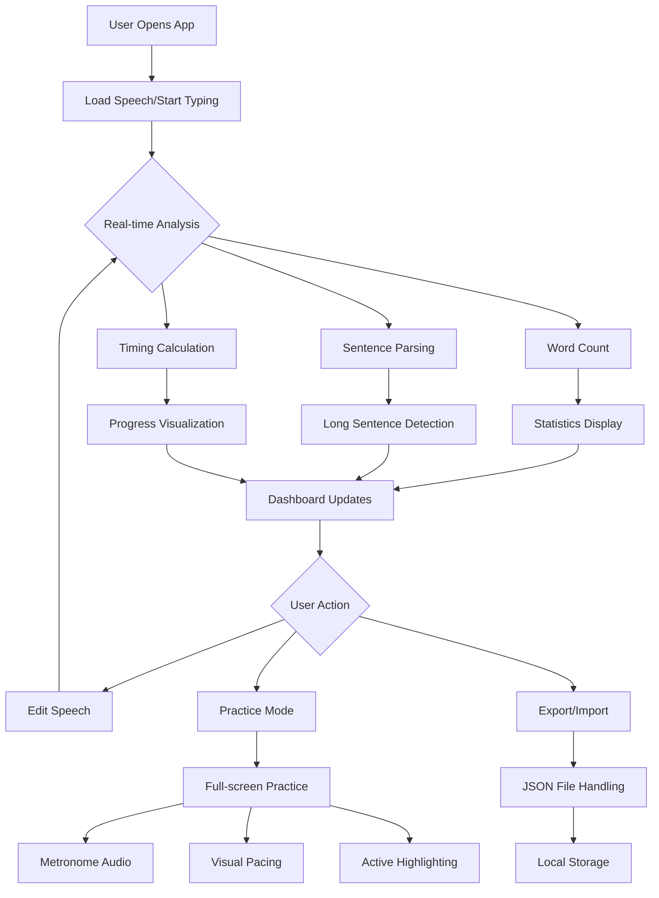
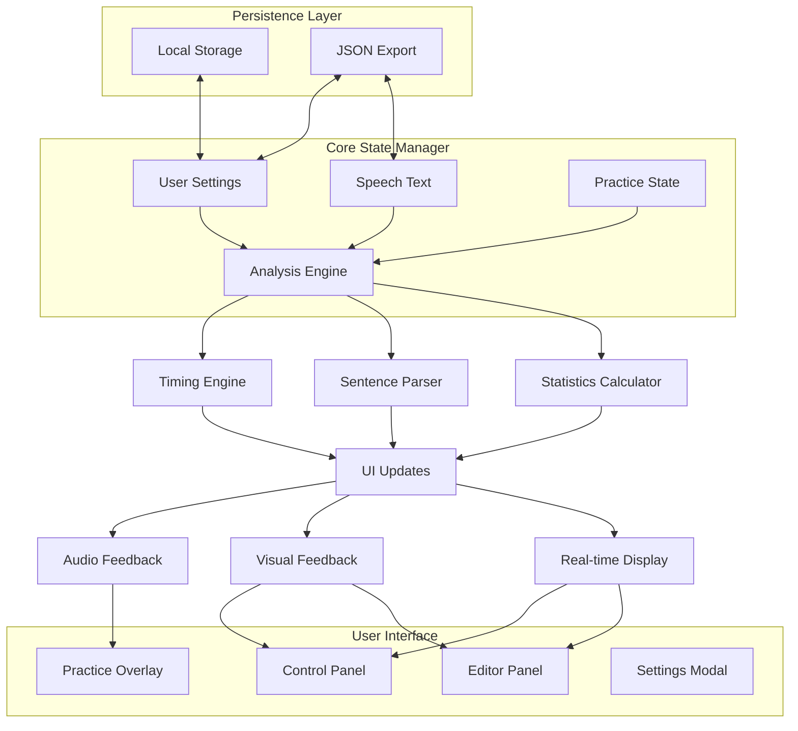
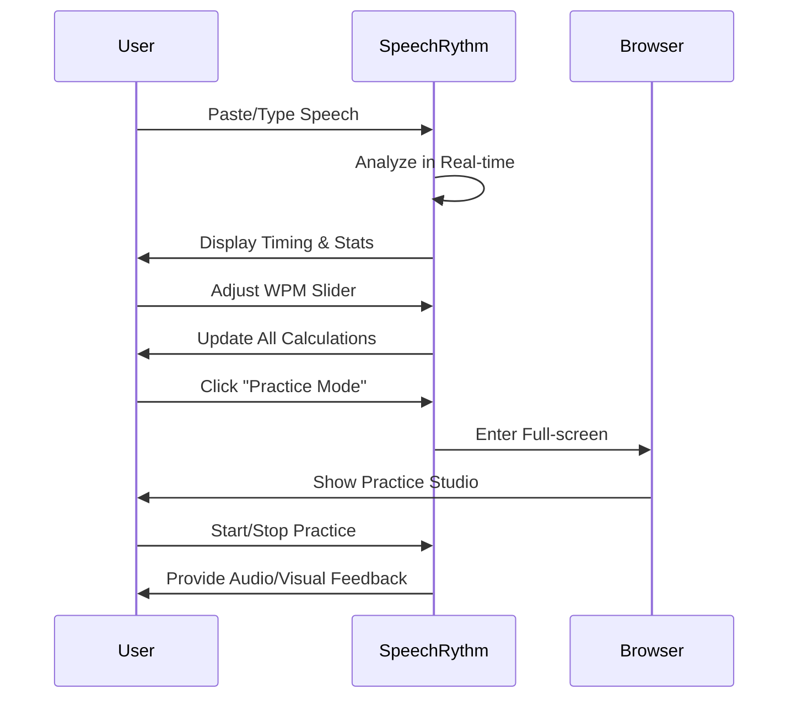
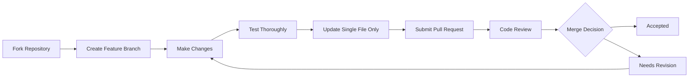

# 🎤 SpeechRythm

<div align="center">


**The intelligent speaking coach that helps you speak confidently and finish on time**

[🚀 Live Demo](https://aliriyaj007.github.io/SpeechRythm/) | [📥 Direct Download](https://raw.githubusercontent.com/Aliriyaj007/SpeechRythm/main/index.html) | [🐛 Report Bug](https://github.com/Aliriyaj007/SpeechRythm/issues) | [💡 Request Feature](https://github.com/Aliriyaj007/SpeechRythm/issues)

</div>

## 📋 Table of Contents

- [📖 Overview](#-overview)
- [🎯 Why SpeechRythm Exists](#-why-speechrythm-exists)
- [🔄 Before vs After](#-before-vs-after)
- [⚡ Get Started in 60 Seconds](#-get-started-in-60-seconds)
- [✨ Features](#-features)
- [🏗️ Architecture](#️-architecture)
- [🚀 Installation & Usage](#-installation--usage)
- [🧩 Project Structure](#-project-structure)
- [🤝 Contributing](#-contributing)
- [📄 License](#-license)
- [👤 Author & Contact](#-author--contact)

## 📖 Overview

SpeechRythm is a **complete, single-file web application** that transforms any speaker—from nervous presenters to professional educators—into confident, time-aware communicators. It provides real-time feedback on pacing, sentence complexity, and delivery without requiring any installation, accounts, or internet connection after download.

Built with pure HTML, CSS, and vanilla JavaScript, SpeechRythm embodies the principle that the best tools are those that empower without complicating. It's a **personal speaking coach in your browser** that turns subjective anxiety ("Am I too slow?") into objective, solvable metrics.

## 🎯 Why SpeechRythm Exists

Public speaking anxiety is timeless, but traditional preparation tools are either too complex or insufficient. Existing solutions often require:

- ❌ Complex software installations
- ❌ Monthly subscriptions
- ❌ Internet connectivity
- ❌ Compromised privacy (cloud processing)
- ❌ Steep learning curves

SpeechRythm solves this by being:
- ✅ **Single HTML file** - No installation, works everywhere
- ✅ **100% client-side** - Your speech never leaves your computer
- ✅ **Instant utility** - Paste your speech, get immediate insights
- ✅ **Progressive depth** - Simple at first, powerful when needed
- ✅ **Privacy-focused** - No tracking, no accounts, no databases

## 🔄 Before vs After

### Before SpeechRythm

| Scenario | Pain Point | Typical Outcome |
|----------|------------|-----------------|
| Preparing a 10-minute presentation | Constantly checking clock while reading aloud | Finish practice runs unsure about actual timing |
| Wedding toast preparation | No objective measure of speech length | Risk speaking too long during important moments |
| Conference talk rehearsal | Difficult to identify overly complex sentences | Audience loses focus during dense sections |
| Classroom presentation | No visual pacing guide | Speak too fast due to nerves, finish early |

### After SpeechRythm

| Scenario | Solution | Result |
|----------|----------|--------|
| Preparing a 10-minute presentation | Real-time timer adjusts as you edit | Know exactly when you'll finish before speaking |
| Wedding toast preparation | Set target time, see progress bar | Confidently stay within allotted time |
| Conference talk rehearsal | Long sentences automatically highlighted | Simplify complex parts for better comprehension |
| Classroom presentation | Visual pacing dot and metronome | Maintain perfect speaking rhythm under pressure |

## ⚡ Get Started in 60 Seconds

### Method 1: Live Demo (Fastest)
1. Visit **[https://aliriyaj007.github.io/SpeechRythm/](https://aliriyaj007.github.io/SpeechRythm/)**
2. Start typing or paste your speech
3. See your reading time update instantly

### Method 2: Download & Run Locally
```bash
# Download the single HTML file
curl -O https://raw.githubusercontent.com/Aliriyaj007/SpeechRythm/main/index.html

# Open in your browser
open index.html  # macOS
start index.html # Windows
xdg-open index.html # Linux
```

### Method 3: GitHub Repository
```bash
# Clone the repository
git clone https://github.com/Aliriyaj007/SpeechRythm.git
cd SpeechRythm

# Open the application
open index.html  # or equivalent for your OS
```

### Quick Start Guide
1. **Paste your speech** into the editor
2. **Adjust the WPM slider** to match your speaking pace (150 WPM is average)
3. **View your timing** in the large display
4. **Check long sentences** highlighted in yellow
5. **Click "Practice Mode"** to rehearse with visual/audio guides

## ✨ Features

### 🎯 Core Functionality
| Feature | Description | Benefit |
|---------|-------------|---------|
| **Real-time Timing** | Calculates reading time as you type | Instant feedback without manual calculation |
| **Adjustable WPM** | 80-250 words per minute slider | Customize for your speaking style |
| **Sentence Analysis** | Identifies overly long sentences | Improve clarity and audience comprehension |
| **Heatmap Visualization** | Color-coded sentence length display | Spot dense sections at a glance |

### 🎨 Premium Experience
| Feature | Description | Benefit |
|---------|-------------|---------|
| **8 Built-in Themes** | Ocean, Dark, Nature, Sunset, Midnight, Berry, Oceanic, Classic | Perfect visual environment for any preference |
| **Practice Studio** | Full-screen rehearsal with pacing guides | Professional-grade practice environment |
| **Metronome & Pacing Dot** | Visual/audio rhythm guidance | Maintain consistent speaking pace |
| **Speech Sections** | Divide presentations into timed segments | Manage complex talks section by section |

### ⚙️ Advanced Capabilities
| Feature | Description | Benefit |
|---------|-------------|---------|
| **Markup Parsing** | Supports `(PAUSE)`, `(SLOW)`, `(EMPHASIS)` cues | Add delivery instructions within your text |
| **Import/Export** | Save and load speeches as JSON files | Backup your work or share with others |
| **Customizable UI** | Adjust fonts, spacing, and behavior | Tailor the interface to your workflow |
| **Keyboard Shortcuts** | Quick actions without leaving keyboard | Faster editing and practice sessions |

### 📱 Cross-Platform Compatibility
| Platform | Status | Notes |
|----------|--------|-------|
| **Desktop Browsers** | ✅ Fully Supported | Chrome, Firefox, Safari, Edge |
| **Mobile Browsers** | ✅ Fully Responsive | iOS Safari, Chrome Mobile |
| **Tablets** | ✅ Optimized Touch | iPadOS, Android tablets |
| **Offline Use** | ✅ 100% Functional | Works without internet after download |

## 🏗️ Architecture

### Technical Stack
```yaml
Frontend: Pure HTML5, CSS3, Vanilla JavaScript
Architecture: Single-File Application (SFA)
State Management: Client-side with localStorage persistence
Audio: Web Audio API for metronome
Export: JSON-based file system
No Dependencies: Zero external libraries or frameworks
```

### Application Flow



### State Management Architecture



## 🚀 Installation & Usage

### Detailed Installation Methods

#### Option A: Direct File Download
1. **Download the single HTML file:**
   ```bash
   # Using wget
   wget https://raw.githubusercontent.com/Aliriyaj007/SpeechRythm/main/index.html
   
   # Using curl
   curl -L -o SpeechRythm.html https://raw.githubusercontent.com/Aliriyaj007/SpeechRythm/main/index.html
   ```

2. **Open in browser:**
   - Double-click the downloaded file, OR
   - Right-click → "Open With" → Your browser, OR
   - Drag and drop onto browser window

#### Option B: Self-Hosting
```html
<!-- Embed in your website -->
<iframe 
    src="https://aliriyaj007.github.io/SpeechRythm/" 
    width="100%" 
    height="800px"
    style="border: 1px solid #ddd; border-radius: 8px;">
</iframe>
```

#### Option C: Browser Bookmarklet
```javascript
// Save as bookmark for instant access
javascript:(function(){
    window.open('https://aliriyaj007.github.io/SpeechRythm/',
                'SpeechRythm',
                'width=1200,height=800,resizable=yes');
})();
```

### Complete Usage Guide

#### Basic Workflow


#### Advanced Features Tutorial

**1. Speech Sectioning:**
```javascript
// Example: Breaking down a presentation
1. Click "Add Section" in Sections panel
2. Name: "Introduction"
3. Repeat for "Main Points", "Case Study", "Conclusion"
4. Practice each section individually
```

**2. Markup Usage:**
```markdown
Good morning! (PAUSE)

I want to discuss (EMPHASIS) three key points (EMPHASIS).

First, (SLOW) this is very important.

Second, another point here.

Third, the final point. (PAUSE)

Thank you for listening.
```

**3. Keyboard Shortcuts:**
| Shortcut | Action | Context |
|----------|--------|---------|
| `Ctrl/Cmd + S` | Export speech | Anywhere |
| `Ctrl/Cmd + E` | Enter practice mode | Anywhere |
| `Ctrl/Cmd + L` | Clear editor | Anywhere |
| `Ctrl/Cmd + ?` | Show help | Anywhere |
| `Escape` | Exit practice/close modals | Practice/Modal |
| `Space` | Play/Pause practice | Practice mode |

## 🧩 Project Structure

```
SpeechRythm/
├── 📄 index.html                    # Complete application (single file)
├── 📁 docs/                         # Documentation (if needed)
├── 📁 screenshots/                  # Project screenshots
└── README.md                       # This file
```

### Single File Architecture
The entire application exists within `index.html` with clear sections:

```html
<!DOCTYPE html>
<html>
<head>
    <!-- Metadata & External Resources -->
    <!-- Google Fonts & Font Awesome -->
    <!-- Complete CSS with 8 themes -->
</head>
<body>
    <!-- UI Structure -->
    <!-- Header with theme selector -->
    <!-- Main editor and control panels -->
    <!-- Practice overlay -->
    <!-- Modals for settings/guide -->
    <!-- Footer with credits -->
    
    <!-- JavaScript Modules -->
    <script>
        // State Manager (IIFE)
        // Utilities Module
        // UI Manager
        // Practice Manager
        // Event Handlers
        // Initialization
    </script>
</body>
</html>
```

### Module Responsibilities

| Module | Responsibility | Key Functions |
|--------|----------------|---------------|
| **State Manager** | Application state & persistence | `updateState()`, `getState()`, localStorage |
| **Utilities** | Core calculations & helpers | Word counting, timing, import/export |
| **UI Manager** | DOM manipulation & rendering | Theme application, real-time updates |
| **Practice Manager** | Practice session handling | Metronome, timer, pacing controls |
| **Event Handlers** | User interaction | Input handling, button clicks, shortcuts |

## 🤝 Contributing

SpeechRythm welcomes contributions that maintain its **single-file philosophy** and **zero-dependency commitment**.

### Contribution Guidelines



### Development Workflow

1. **Fork the repository**
   ```bash
   # Clone your fork
   git clone https://github.com/YOUR_USERNAME/SpeechRythm.git
   cd SpeechRythm
   ```

2. **Create a feature branch**
   ```bash
   git checkout -b feature/amazing-feature
   ```

3. **Make your changes** following these principles:
   - ✅ Keep everything in `index.html`
   - ✅ No external dependencies
   - ✅ Maintain modular JavaScript structure
   - ✅ Preserve all existing functionality
   - ✅ Add tests if applicable

4. **Test your changes**
   ```bash
   # Open the HTML file in multiple browsers
   open index.html
   # Test on mobile if possible
   ```

5. **Commit and push**
   ```bash
   git add index.html
   git commit -m "Add amazing feature"
   git push origin feature/amazing-feature
   ```

6. **Open a Pull Request**

### Areas Needing Contribution

| Area | Priority | Skills Needed | Good First Issue? |
|------|----------|---------------|-------------------|
| **Additional Themes** | Medium | CSS, Design | ✅ Yes |
| **More Keyboard Shortcuts** | Low | JavaScript | ✅ Yes |
| **Enhanced Export Formats** | Medium | JavaScript, JSON | ⚠️ Intermediate |
| **Accessibility Improvements** | High | HTML, ARIA | ✅ Yes |
| **Performance Optimizations** | Medium | JavaScript | ⚠️ Intermediate |
| **Documentation** | Low | Technical Writing | ✅ Yes |

### Code Style
- **Indentation**: 4 spaces (no tabs)
- **Naming**: camelCase for variables/functions, PascalCase for constructors
- **Comments**: JSDoc style for functions, inline for complex logic
- **Structure**: IIFE pattern for module encapsulation

## 📄 License

Copyright © 2024 Riyajul Ali. Released under the MIT License.

```
MIT License

Permission is hereby granted, free of charge, to any person obtaining a copy
of this software and associated documentation files (the "Software"), to deal
in the Software without restriction, including without limitation the rights
to use, copy, modify, merge, publish, distribute, sublicense, and/or sell
copies of the Software, and to permit persons to whom the Software is
furnished to do so, subject to the following conditions:

The above copyright notice and this permission notice shall be included in all
copies or substantial portions of the Software.

THE SOFTWARE IS PROVIDED "AS IS", WITHOUT WARRANTY OF ANY KIND, EXPRESS OR
IMPLIED, INCLUDING BUT NOT LIMITED TO THE WARRANTIES OF MERCHANTABILITY,
FITNESS FOR A PARTICULAR PURPOSE AND NONINFRINGEMENT. IN NO EVENT SHALL THE
AUTHORS OR COPYRIGHT HOLDERS BE LIABLE FOR ANY CLAIM, DAMAGES OR OTHER
LIABILITY, WHETHER IN AN ACTION OF CONTRACT, TORT OR OTHERWISE, ARISING FROM,
OUT OF OR IN CONNECT WITH THE SOFTWARE OR THE USE OR OTHER DEALINGS IN THE
SOFTWARE.
```

## 👤 Author & Contact

<div align="center">

**Riyajul Ali** – Building practical tools that solve real problems

[](https://github.com/Aliriyaj007)
[](mailto:aliriyaj007@protonmail.com)
[](https://linkedin.com/in/Aliriyaj007)

</div>

---

<div align="center">

### 🌟 If this tool helped you, consider giving it a star!

[](https://github.com/Aliriyaj007/SpeechRythm/stargazers)
[](https://github.com/Aliriyaj007/SpeechRythm/network/members)

**"The best tools don't just solve problems—they disappear into the workflow."**

</div>
